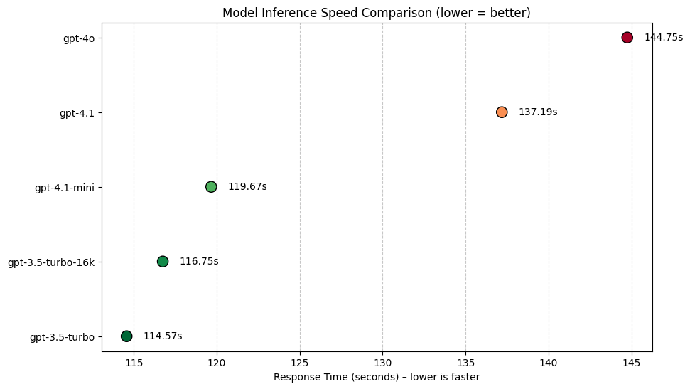

# srt-Translator
A subtitle translator for SRT files, powered by an LLM


## Setup

가상환경 설정

```bash
python3 -m venv venv

source venv/bin/activate
```

Python dependencies:
```bash
pip install pysrt openai python-dotenv tqdm
```
</br>

LLM API key 설정
```bash
touch .env
```
or 
```bash
echo 'OPENAI_API_KEY=sk-xxxxxxxxxxxxxxxxxxxxxxxxxxxxxxxx' > .env
```

.env 파일에 OPENAI_API_KEY=sk-xxxx... 을 입력하면 된다.
</br></br>

## 모델별 속도 테스트

| 모델                | 소요 시간 (초) |
|---------------------|:-------------:|
| gpt-4.1             |   137.19      |
| gpt-4o              |   144.75      |
| gpt-4.1-mini        |   119.67      |
| gpt-3.5-turbo       |   114.57      |
| gpt-3.5-turbo-16k   |   116.75      |


